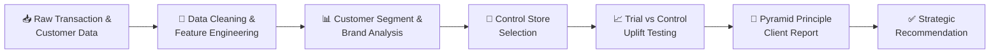

<div align="center">

# Quantium Data Analytics Virtual Experience
### Retail Strategy, Experimentation & Commercial Insights for a Chips Category

[](.)
[](.)
[](.)
[](.)
[](.)
[](.)

**A 3-part virtual internship simulation with Quantium's Retail Analytics team — transforming raw customer and transaction data into a boardroom-ready strategic recommendation.**

[Overview](#-project-overview) •
[Business Problem](#-business-problem) •
[Repository Structure](#-repository-structure) •
[Tech Stack](#-tech-stack) •
[Workflow](#-project-workflow) •
[Key Highlights](#-key-highlights) •
[Navigate to Tasks](#-explore-each-task)

</div>

---

## 📌 Project Overview

This repository documents my completion of the **Quantium Data Analytics Job Simulation**, a virtual work-experience program modeled on real engagements at Quantium's retail analytics practice.

Acting as an analyst on Quantium's client-facing team, I was engaged by the **Category Manager for Chips** at a national supermarket chain to answer two strategic questions ahead of the next half-year planning cycle:

1. **Who** is buying chips, and how does that differ by customer type?
2. **Did** a new in-store layout trial actually drive incremental sales — and should it be rolled out further?

The project moves through the full analytics lifecycle — data cleaning, exploratory analysis, statistical experimentation, and executive storytelling — culminating in a client-ready strategic presentation built on the **Pyramid Principle**.

> 🎓 Simulation completed and certified by **Quantium × Forage**, July 2026.

---

## 💼 Business Problem

The client — the **Category Manager for Chips** — needed a data-backed foundation for the upcoming strategic plan, specifically:

| Question | Business Need |
|---|---|
| 🧍 Who buys chips, and how? | Understand customer segments and purchasing drivers to prioritize marketing spend |
| 🏬 Did the new store layout work? | Test trial stores against matched controls to decide on a wider rollout |
| 📊 What should we do next? | Translate technical findings into a clear, non-technical, actionable recommendation |

The analysis was based on **12 months of transaction and loyalty data** across **272 stores** and a **3-store layout trial**, with the final output designed for direct use by the Category Manager in the FY strategic plan.

---

## 🗂 Repository Structure

```

Quantium Data Analytics Virtual Experience
│
├── Task 1: Customer Behaviour Analytics
│   ├── Raw Datasets
│   ├── Data preparation & customer analytics (Python)
│   └── README.md
│
├── Task 2: Experimentation & Uplift Testing
│   ├── Raw Dataset
│   ├── Experimentation & Uplift Testing (Python)
│   └── README.md
│
└── Task 3: Commercial Insights & Strategic Recommendations
    ├── Pyramid Principle client presentation
    └── README.md

```

Each task folder contains its own detailed README with methodology, code walkthroughs, and visuals — this page is the landing page and navigation hub for the full project.

---

## 🛠 Tech Stack

| Category | Tools |
|---|---|
| **Language** | Python |
| **Data Wrangling** | pandas |
| **Visualization** | Matplotlib, Seaborn |
| **Statistical Method** | Pearson correlation & magnitude-distance matching for control store selection |
| **Reporting** | PowerPoint (Pyramid Principle framework) |
| **Version Control** | Git, GitHub |

---

## 🔄 Project Workflow



**Step-by-step:**

1. **Clean & prepare** two raw datasets (transactions + customer loyalty data), engineering features like brand, pack size, and life stage.
2. **Profile customers** by life stage and spending segment to identify who drives category sales.
3. **Select statistically similar control stores** for each of 3 trial stores using a custom correlation + magnitude-distance matching function.
4. **Test the trial layout's impact** on sales, customer counts, and transaction frequency during the trial period.
5. **Package findings** into a client-ready strategic presentation using the Pyramid Principle, aimed at a non-technical business audience.

---

## 🔍 Key Highlights

- 📈 **12 months** of transaction data across **272 stores** analyzed end-to-end in Python
- 🧮 Built a **custom store-matching algorithm** combining Pearson correlation and magnitude distance to select valid control stores
- 🏆 Identified **Kettle** as the dominant brand and **Older/Mainstream/Budget households** as the highest-value customer segments
- ✅ All **3 trial stores outperformed their matched controls**, supporting a phased layout rollout
- 📑 Delivered a full **executive-ready presentation** using the Pyramid Principle — the same framework used in real Quantium client reports
- 🧪 Applied a rigorous **test-vs-control experimental design**, not just descriptive analytics

---

## 🚀 Explore Each Task

<div align="center">

| | | |
|:---:|:---:|:---:|
| **Task 1** | **Task 2** | **Task 3** |
| Customer Behaviour Analytics | Experimentation & Uplift Testing | Commercial Insights & Recommendations |
| Data cleaning, feature engineering, and customer/brand segmentation | Control store matching and statistical trial evaluation | Pyramid-Principle strategic report for the Category Manager |
| [**→ View Task 1**](./Task-1-Customer-Behaviour-Analytics) | [**→ View Task 2**](./Task-2-Experimentation-and-Uplift-Testing) | [**→ View Task 3**](./Task 3: Commercial Insights & Strategic Recommendations) |

</div>

---

## 🎓 Certification

This project was completed as part of the **Quantium Data Analytics Job Simulation**, hosted on Forage, covering:

- Data preparation and customer analytics
- Experimentation and uplift testing
- Analytics and commercial application

<a href="./Certificate.pdf" target="_blank">
  
</a>

---

## 👤 Author

**Kiran Kalisetti**
Aspiring Data Analyst

<a href="https://www.linkedin.com/in/kiran-kalisetti" target="_blank">
  
</a>
&nbsp;
<a href="mailto:kalisettikiran920@gmail.com?subject=Regarding%20your%20Quantium%20Data%20Analytics%20Project">
  
</a>
&nbsp;
<a href="https://github.com/kalisettikiran920-afk" target="_blank">
  
</a>

---

<div align="center">

*Built with Python · pandas · Matplotlib · Seaborn · PowerPoint*

</div>
