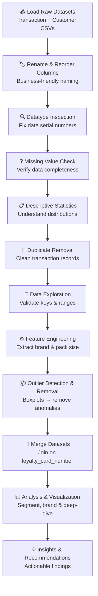

<div align="center">

# 📊 Task 1 — Customer Behaviour Analytics
### Retail Strategy & Analytics · Quantium Data Analytics Job Simulation

[](.)
[](.)
[](.)
[](.)
[](.)

**Transform 12 months of raw transaction and loyalty data into actionable customer intelligence for the Chips category.**

[Objective](#-objective) •
[Datasets](#-datasets) •
[Workflow](#-workflow) •
[Data Cleaning](#-data-cleaning--preparation) •
[Feature Engineering](#-feature-engineering) •
[Analysis](#-data-analysis--visualization) •
[Key Insights](#-key-insights) •
[Recommendations](#-business-recommendations)

</div>

---

← [Back to Main Project](../README.md)

---

## 🎯 Objective

The **Category Manager for Chips** at a national supermarket chain needed a data-backed customer profile to guide the upcoming half-year strategic plan. The core questions this task answers:

| Business Question | Analytical Approach |
|---|---|
| Who buys chips, and how much do they spend? | Customer segmentation by life stage & spending segment |
| Which life stage and spending segment drives the most revenue? | Grouped aggregation + heatmap analysis |
| Which brands and products are most preferred? | Brand-level and product-level sales ranking |
| Are there any actionable patterns in purchasing behaviour? | Cross-segment deep dive with pivot table analysis |

---

## 📁 Datasets

Two raw datasets were provided as inputs for this task:

### 1. `QVI_transaction_data.xlsx` — Transaction Data
> One row = one product purchased in a store transaction.

| Column | Renamed To | Description |
|---|---|---|
| `TXN_ID` | `transaction_id` | Transaction identifier *(not a true primary key — confirmed via analysis)* |
| `DATE` | `date` | Purchase date, stored as Excel serial number → converted to datetime |
| `LYLTY_CARD_NBR` | `loyalty_card_number` | Customer identifier (foreign key linking to customer data) |
| `STORE_NBR` | `store_number` | Store where the purchase occurred |
| `PROD_NBR` | `product_number` | Product identifier |
| `PROD_NAME` | `product_name` | Full product name, e.g. *"Smiths Crinkle Cut Chips BBQ 175g"* |
| `PROD_QTY` | `quantity` | Number of packs purchased per transaction |
| `TOT_SALES` | `sales` | Total amount spent in the transaction |

> **Note on `transaction_id`:** Although it appears to be a primary key, analysis confirmed that `transaction_id` is **not unique** — a single transaction can include multiple products (rows), each with its own row sharing the same ID. For example, `transaction_id = 628` appears more than once. This is a critical data characteristic that was identified and documented.

---

### 2. `QVI_purchase_behaviour.csv` — Customer Loyalty Data
> One row = one unique customer identified by their loyalty card.

| Column | Renamed To | Description |
|---|---|---|
| `LYLTY_CARD_NBR` | `loyalty_card_number` | Primary key — uniquely identifies each customer |
| `LIFESTAGE` | `life_stage` | Where the customer is in their life journey |
| `PREMIUM_CUSTOMER` | `spending_segment` | Purchasing behaviour tier |

#### Life Stage Categories

| Life Stage | Description |
|---|---|
| `YOUNG SINGLES/COUPLES` | Young adults without children |
| `MIDAGE SINGLES/COUPLES` | Middle-aged adults without children |
| `NEW FAMILIES` | Families with very young children |
| `YOUNG FAMILIES` | Families with school-age children |
| `OLDER FAMILIES` | Families whose children are older or nearly independent |
| `OLDER SINGLES/COUPLES` | Older adults without dependent children |
| `RETIREES` | Customers who have retired from work |

#### Spending Segment Categories

| Spending Segment | Description |
|---|---|
| `Budget` | Prefer lower-priced products; focus on saving money |
| `Mainstream` | Average customers with balanced purchasing behaviour |
| `Premium` | Willing to spend more on higher-quality or premium brands |

---

## 🔄 Workflow



---

## 🧹 Data Cleaning & Preparation

### Step 1 — Rename Columns
All columns were renamed from cryptic uppercase codes (e.g., `LYLTY_CARD_NBR`, `PROD_QTY`) to readable, snake_case business names (e.g., `loyalty_card_number`, `quantity`). This improves code clarity and makes the analysis self-documenting.

### Step 2 — Reorder Columns
The transaction dataframe columns were reordered logically:
`transaction_id → date → loyalty_card_number → store_number → product_number → product_name → quantity → sales`

This puts identifiers first and measurable values last — a natural reading order for analysts and business stakeholders.

### Step 3 — Fix Date Format
The `date` column in the transaction data was stored as an **Excel serial number** (days since 30-Dec-1899). It was converted to proper Python `datetime` objects:
```python
df_transactions['date'] = pd.to_datetime(df_transactions['date'], unit='D', origin='1899-12-30')
```

### Step 4 — Missing Value Check
Both datasets were checked for null values. No missing values were found in either dataset, confirming data completeness.

### Step 5 — Descriptive Statistical Analysis
`.describe(include="all")` was run on both datasets to understand distributions, ranges, and cardinality across all columns before any further processing.

### Step 6 — Duplicate Removal
- **Customers dataset:** No duplicates found (72,637 unique customers confirmed as the primary key).
- **Transactions dataset:** Duplicates were identified and removed using `.drop_duplicates()`.

### Step 7 — Data Exploration & Validation

| Check | Finding |
|---|---|
| `transaction_id` uniqueness | ❌ Not a primary key — same ID can appear with different products |
| `loyalty_card_number` in transactions | ✅ 72,637 unique values — matches the customer dataset exactly |
| Date range | 12 months of data (Jul 2018 – Jun 2019) |
| Number of stores | 272 stores |
| Number of products | 114 distinct products |

### Step 8 — Outlier Detection & Removal
Boxplots were used to visually identify outliers in the `quantity` and `sales` columns.

Two transactions were found with a quantity of **200** and sales of **$650**, far outside the normal purchasing range. These were identified as **business anomalies** (not genuine customer purchases) and removed:
```python
df_transactions = df_transactions[df_transactions["quantity"] != 200]
```

> **Reasoning:** The goal of the project is to analyse *typical* customer purchasing behaviour. Keeping extreme outliers would distort segment averages and mislead the Category Manager on actual customer patterns.

---

## ⚙️ Feature Engineering

Two new features were extracted from the `product_name` column to enable brand and pack size analysis:

### 1. `pack_size_in_gms`
Extracted by parsing the numeric value (grams) at the end of each product name using a regex:
```python
df_transactions["pack_size_in_gms"] = df_transactions["product_name"].str.extract(r"(\d+)")
df_transactions["pack_size_in_gms"] = df_transactions["pack_size_in_gms"].astype('int')
```
> **Why:** Pack size is a product attribute not available as a standalone column. Extracting it enables analysis of whether customers prefer larger or smaller packs.

### 2. `product_brand`
Extracted using a custom function that parses the start of the product name to identify the brand. Multi-word brand names (e.g., "Red Rock Deli", "Old El Paso") were handled as special cases before applying a generic first-word extraction rule:
```python
def extract_brand(product):
    if product.startswith("Red Rock Deli"):
        return "Red Rock Deli"
    elif product.startswith("Old El Paso"):
        return "Old El Paso"
    # ... additional special cases
    else:
        return product.split()[0]
```
> **Why:** Brand is not a standalone column — it is embedded in the product name string. Extracting it enables brand-level sales comparison and preference analysis, which is a key deliverable for the Category Manager.

---

## 📊 Data Analysis & Visualization

After cleaning and feature engineering, the two datasets were merged on `loyalty_card_number` (left join) to create a unified analytical dataframe.

### 1) Customer Segment Analysis

#### Q: Which customer life stages generate the highest sales, and how does their contribution differ?
- Grouped total sales by `life_stage` and plotted a horizontal bar chart (sorted ascending).
- **Finding:** Older Families and Retirees generate the highest total sales, while New Families contribute the least.

#### Q: How does sales performance vary across different customer spending segments?
- Grouped total sales by `spending_segment` and plotted a vertical bar chart.
- **Finding:** Mainstream customers are the largest revenue segment, followed by Budget, with Premium contributing the least.

- Pie charts were used to visualise the **percentage contribution** of each life stage and spending segment to total category sales.

---

### 2) Product Preference Analysis

#### Q: Which product brands are the most popular and contribute the highest sales?
- Calculated total sales by `product_brand`, ranked and plotted the **Top 10 brands** as a bar chart.
- **Finding:** **Kettle** is the dominant brand by a clear margin.

#### Q: Which individual products are the most popular by sales?
- Calculated total sales by `product` name, ranked and plotted the **Top 10 products**.
- Confirms that Kettle products appear prominently in the top product list.

---

### 3) Segment Deep Dive — The Heatmap

#### Q: Which combination of customer life stage and spending segment contributes the most to total sales?
- Built a pivot table (`life_stage` × `spending_segment`) with total sales as values.
- Values converted to **thousands (K)** for readability.
- Visualised as a **heatmap** with annotated values.
- **Finding:** The Older Families × Mainstream and Retirees × Mainstream cells show the highest concentration of spending, identifying the supermarket's single most valuable customer group.

---

## 💡 Key Insights

| # | Insight |
|---|---|
| 🥇 | **Mainstream and Budget customers** contribute the highest overall sales — they are the supermarket's most valuable spending segments by volume |
| 👨‍👩‍👧 | **Older Families and Retirees** generate a significant share of total revenue, making them the most profitable customer life stage groups |
| 🏆 | **Kettle** emerged as the best-performing chip brand, showing strong and consistent customer preference across segments |
| 🔢 | Sales are **concentrated in a few life stage × spending segment combinations**, with Older Families (Mainstream & Budget) and Retirees being standout groups |
| 🎯 | Customer purchasing behaviour **differs meaningfully across life stages and spending segments**, indicating that segment-specific marketing would outperform generic promotions |

---

## ✅ Business Recommendations

| # | Recommendation | Rationale |
|---|---|---|
| 1 | **Prioritize marketing campaigns for Older Families and Retirees** | These groups contribute the highest sales and offer the greatest revenue potential |
| 2 | **Develop targeted offers for Mainstream and Budget customers** — loyalty rewards, personalised discounts, bundle deals | These are the largest segment by count and spend; incremental loyalty gains have a high impact |
| 3 | **Maintain adequate inventory of top-selling brands like Kettle** | Reduces stockouts on the highest-demand products, directly protecting revenue |
| 4 | **Create segment-specific promotional campaigns** based on life stage and spending behaviour instead of generic promotions | Improves marketing efficiency and return on investment |
| 5 | **Use lower-performing segments as growth opportunities** — trial offers, cross-selling, or limited-time discounts | Encourages higher purchase frequency from segments that currently under-index |

---

## 📂 Files in This Task

| File | Description |
|---|---|
| [`Task_1_Retail_Strategy_and_Analytics.ipynb`](../Jupyter%20Notebooks/Task_1_Retail_Strategy_and_Analytics.ipynb) | Full Python notebook with all code, outputs, and visualizations |
| [`Task_1_Retail_Strategy_and_Analytics.pdf`](../PDF%20files/Task_1_Retail_Strategy_and_Analytics.pdf) | PDF export of the completed notebook |
| [`QVI_transaction_data.xlsx`](../Raw%20Datasets/QVI_transaction_data.xlsx) | Raw transactions dataset (input) |
| [`QVI_purchase_behaviour.csv`](../Raw%20Datasets/QVI_purchase_behaviour.csv) | Raw customer loyalty dataset (input) |
| [`QVI_data.csv`](../Raw%20Datasets/QVI_data.csv) | Merged & cleaned analytical dataset (output) |

---

## 🔗 Navigate

| ← Previous | Home | Next → |
|:---:|:---:|:---:|
| — | [Main Project README](../README.md) | [Task 2 — Experimentation & Uplift Testing](../Task-2-Experimentation-and-Uplift-Testing/README.md) |

---

<div align="center">

*Part of the [Quantium Data Analytics Job Simulation](../README.md) · Completed July 2026*

**Kiran Kalisetti** · [LinkedIn](https://www.linkedin.com/in/kiran-kalisetti) · [GitHub](https://github.com/kalisettikiran920-afk)

</div>
