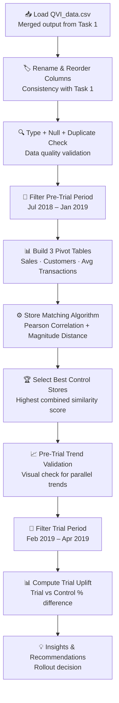

<div align="center">

# 🧪 Task 2 — Experimentation & Uplift Testing
### Control Store Matching & Trial Evaluation · Quantium Data Analytics Job Simulation

[](.)
[](.)
[](.)
[](.)
[](.)
[](.)

**Determine whether a 3-store layout trial drove real sales uplift — by building a custom store-matching algorithm and evaluating trial performance against statistically similar controls.**

[Objective](#-objective) •
[Dataset](#-dataset) •
[Workflow](#-workflow) •
[Data Preparation](#-data-preparation) •
[Store Matching Algorithm](#-store-matching-algorithm) •
[Validation](#-pre-trial-validation) •
[Uplift Analysis](#-trial-uplift-analysis) •
[Key Insights](#-key-insights) •
[Recommendations](#-business-recommendations)

</div>

---

← [Back to Main Project](../README.md) &nbsp;|&nbsp; ← [Task 1 — Customer Behaviour Analytics](../Task-1-Customer-Behaviour-Analytics)

---

## 🎯 Objective

The **Category Manager for Chips** had run a trial of a new in-store layout across **3 stores** (Stores 77, 86, and 88) between **February and April 2019**. Before committing to a full rollout across all 272 stores, she needed evidence that the layout actually caused the sales change — not just a coincidence or a broader market trend.

The core questions this task answers:

| Business Question | Analytical Approach |
|---|---|
| Did the new layout actually increase sales? | Compare trial stores against matched control stores |
| How do we isolate the layout effect from other factors? | Select controls that mirror the trial store's pre-trial behaviour |
| Which trial stores performed best? | Measure percentage uplift across 3 metrics for each store-pair |
| Should the layout be rolled out further? | Translate findings into a rollout recommendation |

> **The key challenge:** Without a matched control, any sales increase could be explained by seasonality, local events, or random variation. The control store acts as the counterfactual — "what would have happened without the new layout?"

---

## 📁 Dataset

Task 2 uses **`QVI_data.csv`** — the merged and cleaned output produced in Task 1, which combines transaction and customer loyalty data into a single unified file.

### Column Schema (after renaming)

| Original Column | Renamed To | Description |
|---|---|---|
| `TXN_ID` | `transaction_id` | Transaction identifier |
| `DATE` | `date` | Purchase date (converted from string to datetime) |
| `LYLTY_CARD_NBR` | `loyalty_card_number` | Customer identifier |
| `STORE_NBR` | `store_number` | Store where the purchase occurred |
| `PROD_NBR` | `product_number` | Product identifier |
| `PROD_NAME` | `product` | Full product name |
| `BRAND` | `product_brand` | Extracted brand name |
| `PACK_SIZE` | `pack_size_in_gms` | Pack size in grams |
| `PROD_QTY` | `quantity` | Number of packs purchased |
| `TOT_SALES` | `sales` | Total sales value of the transaction |
| `LIFESTAGE` | `life_stage` | Customer life stage |
| `PREMIUM_CUSTOMER` | `spending_segment` | Customer spending tier |

> Columns were reordered to follow the same logical structure as Task 1: identifiers → product details → metrics → customer attributes.

### Trial Configuration

| Store | Role | Trial Period |
|---|---|---|
| 77 | Trial store | Feb 2019 – Apr 2019 |
| 86 | Trial store | Feb 2019 – Apr 2019 |
| 88 | Trial store | Feb 2019 – Apr 2019 |
| All other stores | Potential control stores | — |

---

## 🔄 Workflow



---

## 🧹 Data Preparation

### Step 1 — Load the Dataset
`QVI_data.csv` was loaded directly — this is the clean, merged output from Task 1, so it already contains the product brand, pack size, life stage, and spending segment columns.

### Step 2 — Rename & Reorder Columns
All columns were renamed from uppercase codes to readable snake_case names (consistent with Task 1) and reordered logically:
`transaction_id → date → loyalty_card_number → store_number → product_number → product → product_brand → pack_size_in_gms → quantity → sales → life_stage → spending_segment`

### Step 3 — Data Quality Checks
| Check | Result |
|---|---|
| Null values | ✅ None found |
| Duplicate records | Duplicates identified and removed with `.drop_duplicates()` |
| Date column type | Converted from string to `datetime` using `pd.to_datetime()` |

### Step 4 — Split Into Pre-Trial and Trial Periods

| Period | Date Range | Purpose |
|---|---|---|
| **Pre-trial** | Jul 2018 – Jan 2019 | Baseline for control store selection and trend validation |
| **Trial** | Feb 2019 – Apr 2019 | Evaluation period to measure layout impact |

---

## ⚙️ Store Matching Algorithm

The most technically significant part of this task. A custom Python function was built to find, for each trial store, the single best matching control store from all 272 stores.

### Why Matching Matters
A naive comparison ("trial store sales went up") does not isolate the layout effect. The control store provides the counterfactual: if a perfectly similar store (without the new layout) grew by 5%, and the trial store grew by 40%, then the layout likely caused a ~35% incremental uplift.

### Step 1 — Build Pre-Trial Pivot Tables
Three monthly time-series pivot tables were created for the pre-trial period, each indexed by `store_number`:

| Pivot Table | Metric | Aggregation |
|---|---|---|
| `pre_trial_pivot` | Monthly total sales | `sum` |
| `customers_pivot` | Monthly unique customers | `nunique` |
| `avg_tx_pivot` | Avg transactions per customer | `count / nunique` |

Each pivot has one row per store and one column per month (Jul 2018 – Jan 2019), giving a 7-point monthly time series for every store.

### Step 2 — Similarity Function: Two-Component Score

The `calculate_similarity()` function computes two scores for every trial store ↔ candidate store pair, applied separately to both the Sales and Customers pivots:

#### Component 1: Pearson Correlation (Trend Alignment)
Measures whether the two stores move **up and down in the same pattern** month over month. A value of `1.0` means perfectly correlated trends; `0` means no relationship.

```python
corr = trial_vals.corr(cand_vals)
```

> **Why it matters:** A control store must follow the same seasonal rhythm as the trial store. If chip sales spike in December at the trial store but not the control, they cannot be meaningfully compared during the trial.

#### Component 2: Normalized Magnitude Distance (Volume Alignment)
Measures whether the two stores are **similar in absolute size** (total sales / customer volume). The raw absolute difference is normalized by the trial store's average, then inverted so that `1.0` = identical scale and `0` = very different scale.

```python
abs_diff = np.abs(trial_vals - cand_vals)
norm_diff = abs_diff.mean() / trial_vals.mean()
magnitude = 1 / (1 + norm_diff)
```

> **Why it matters:** A store selling 10× more chips than the trial store is not a valid control even if its trends are correlated — any shock would affect absolute sales very differently.

### Step 3 — Combined Score & Store Selection
The four individual scores (Sales Correlation, Sales Magnitude, Customer Correlation, Customer Magnitude) were averaged into a single **combined similarity score**:

```python
combined_score = (sales_corr + sales_mag + cust_corr + cust_mag) / 4
```

For each trial store, all other stores (excluding the three trial stores) were scored and ranked. The store with the **highest combined score** was selected as the control.

### Control Store Results

| Trial Store | Best Control Store | Selection Rationale |
|---|---|---|
| **Store 77** | **Store 233** | Highest combined similarity across sales trend, sales volume, customer trend, and customer volume |
| **Store 86** | **Store 155** | Highest combined similarity across all four metrics |
| **Store 88** | **Store 178** | Highest combined similarity across all four metrics |

> All three trial stores were excluded from being candidates for each other's control selection, ensuring clean experimental separation.

---

## 📈 Pre-Trial Validation

Before measuring the trial effect, the control store selections were visually validated to confirm they were genuinely comparable during the pre-trial period.

A `plot_pre_trial_validation()` function generated **side-by-side line charts** for each trial/control pair, covering three metrics:
- Monthly Sales
- Unique Customers
- Average Transactions per Customer

### Validation Pairs

| Pair | Trial Store | Control Store |
|---|---|---|
| 5.1 | Store 77 | Store 233 |
| 5.2 | Store 86 | Store 155 |
| 5.3 | Store 88 | Store 178 |

> **What to look for:** The two lines should track each other closely across all 7 pre-trial months. Any consistent divergence before the trial starts would indicate the control is not a valid match. Visual inspection confirmed all three pairs showed parallel trends, validating the matching algorithm's output.

---

## 📊 Trial Uplift Analysis

### Method
For each trial month (February, March, April 2019), the three metrics were compared between the trial store and its matched control:

| Metric | How Calculated |
|---|---|
| **Sales uplift** | `(Trial Sales - Control Sales) / Control Sales × 100%` |
| **Customer uplift** | `(Trial Customers - Control Customers) / Control Customers × 100%` |
| **Avg transactions uplift** | `(Trial Avg Tx - Control Avg Tx) / Control Avg Tx × 100%` |

A `plot_trial_comparison()` function generated **side-by-side bar charts** for each metric across the three trial months, with percentage uplift printed for each bar.

### Results by Store

#### Store 77 vs Control Store 233
| Month | Sales Uplift | Customer Uplift | Avg Tx Uplift |
|---|---|---|---|
| February 2019 | -3.69% | Modest growth | Slight decline |
| March 2019 | **+39.88%** | Strong growth | Positive |
| April 2019 | **+66.14%** | **+56.67%** | Positive |

*Sales dipped slightly in February then surged in March and April. Customer growth mirrored the sales pattern, suggesting the layout attracted more visitors rather than just increasing spend per visit.*

---

#### Store 86 vs Control Store 155
| Month | Sales Uplift | Customer Uplift | Avg Tx Uplift |
|---|---|---|---|
| February 2019 | +2.47% | Positive | Slight decline |
| March 2019 | **+27.65%** | Positive | Slight decline |
| April 2019 | +0.43% | Positive | Slight decline |

*Results were small and inconsistent. Customer counts rose in all three months, but average spend per visit was slightly down throughout — more footfall, but not translating cleanly into revenue.*

---

#### Store 88 vs Control Store 178
| Month | Sales Uplift | Customer Uplift | Avg Tx Uplift |
|---|---|---|---|
| February 2019 | **+25.84%** | Positive | Flat |
| March 2019 | **+47.90%** | Positive | Flat |
| April 2019 | **+35.82%** | Positive | Flat |

*The most consistent performer across all three months. Sales and customers were up throughout while average transactions per customer stayed roughly flat — pointing clearly to more store visits as the primary driver.*

---

## 💡 Key Insights

> **Note:** These are observed percentage differences, not formally confirmed through statistical hypothesis testing. They should be read as strong directional trends rather than statistically proven causal results.

| # | Insight |
|---|---|
| ✅ | **All 3 trial stores outperformed their matched controls** across the trial period — the new layout is associated with higher sales and more customers in every case |
| 🏆 | **Store 88 was the most consistent** — positive sales uplift in all three months (25–48%), making it the strongest evidence for the layout's effectiveness |
| 📈 | **Store 77 showed the strongest late-trial growth** — sales up 66% and customers up 57% in April, suggesting the layout's impact accelerated over time |
| ⚠️ | **Store 86 showed the weakest and most uneven results** — only +0.43% in April, warranting a closer investigation into why this location responded differently |
| 👣 | **The primary driver of uplift was more customer visits, not larger basket sizes** — average transactions per customer stayed flat or declined slightly across all stores, while customer counts rose |

---

## ✅ Business Recommendations

| # | Recommendation | Rationale |
|---|---|---|
| 1 | **Proceed with a phased rollout, prioritizing stores similar to 77 and 88** | These stores showed the strongest and most consistent uplift across both sales and customer metrics |
| 2 | **Monitor post-rollout performance over a longer window (6+ months)** | The trial only covered 3 months; confirming that gains persist over a full cycle is essential before a full commitment |
| 3 | **Investigate Store 86's weaker performance** | Local competition, store size, customer mix, or layout execution differences may explain the muted results — understanding this protects against over-estimating rollout impact |
| 4 | **Pair the new layout with targeted in-store promotions** | Since uplift was driven mainly by more visits rather than higher spend per visit, promotions (e.g., bundle deals, end-of-aisle offers) could convert the additional footfall into larger basket sizes |
| 5 | **Expand the trial to a wider range of store types before full rollout** | Three stores is a small sample; testing across different store formats, locations, and customer demographics will increase confidence in the findings |

---

## 📂 Files in This Task

| File | Description |
|---|---|
| [`Task_2_Experimentation_and_Uplift_Testing.ipynb`](../Jupyter%20Notebooks/Task_2_Experimentation_and_Uplift_Testing.ipynb) | Full Python notebook with all code, charts, and uplift calculations |
| [`Task_2_Experimentation_and_Uplift_Testing.pdf`](../PDF%20files/Task_2_Experimentation_and_Uplift_Testing.pdf) | PDF export of the completed notebook |
| [`QVI_data.csv`](../Raw%20Datasets/QVI_data.csv) | Input dataset (merged & cleaned output from Task 1) |

---

## 🔗 Navigate

| ← Previous | Home | Next → |
|:---:|:---:|:---:|
| [Task 1 — Customer Behaviour Analytics](../Task-1-Customer-Behaviour-Analytics) | [Main Project README](../README.md) | [Task 3 — Commercial Insights & Recommendations](../Task-3-Commercial-Insights-and-Strategic-Recommendations) |

---

<div align="center">

*Part of the [Quantium Data Analytics Job Simulation](../README.md) · Completed July 2026*

**Kiran Kalisetti** · [LinkedIn](https://www.linkedin.com/in/kiran-kalisetti) · [GitHub](https://github.com/kalisettikiran920-afk)

</div>
